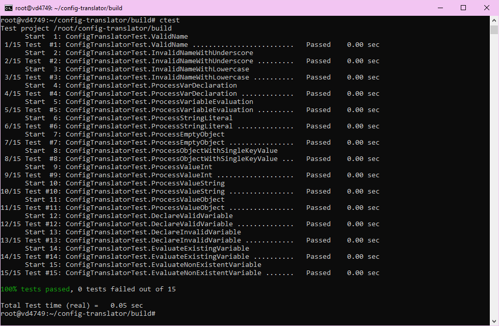

### config-translator

## Общее описание
**config-translator** — это утилита командной строки для преобразования JSON-файлов в пользовательский конфигурационный формат. Программа поддерживает объявление переменных, вычисление их значений на этапе трансляции, а также обнаружение синтаксических ошибок.

## Описание всех функций и настроек

**Основные возможности**:
   - Поддержка синтаксиса:
     - **Словари**: `{"NAME": значение}`.
     - **Имена**: Только заглавные латинские буквы `[A-Z]+`.
     - **Значения**:
       - Числа.
       - Строки в формате `q(строка)`.
       - Словари.
     - **Объявление переменных**: `var NAME = value;`.
     - **Вычисление переменных**: `#[NAME]`.
   - Обработка ошибок (некорректный JSON, синтаксические ошибки).
   - Вывод в стандартный вывод или в файл.

**Параметры командной строки**:
   - `--input` (`-i`): Путь к входному JSON-файлу (обязательный).
   - `--output` (`-o`): Путь к выходному файлу (по умолчанию — стандартный вывод).
   - `--help` (`-h`): Вывод справки.

## Cборка проекта

Необходимые зависимости для разработки:
- **gcc**, **clang** или **msvc** (поддержка C++17 и выше).
- **Conan**
- **CMake**

### Подготовка профиля Conan (например, для gcc):
Создайте файл профиля или используйте команду `conan profile detect`:
```yml
[settings]
arch=x86_64
build_type=Release
compiler=gcc
compiler.cppstd=gnu17
compiler.libcxx=libstdc++11
compiler.version=13
os=Linux
```

### Команды для сборки:
1. Инициализация сборки:
   ```bash
   conan profile detect --force
   mkdir build
   conan install . --output-folder=build --build=missing
   cd build
   cmake .. --preset conan-release
   ```
2. Запуск CMake (в папке build):
   ```bash
   cmake --build . --config Release
   ```

## Примеры использования

### Запуск утилиты:
```bash
./config_translator --input input.json
```

### Пример входного JSON:
```json
{
  "CONFIG": {
    "NAME": "var MYVAR = 100",
    "VALUE": "#[MYVAR]",
    "GREETING": "Hello, World"
  }
}
```

### Результат:
```text
{
 CONFIG : {
  NAME : ,
  VALUE : 100,
  GREETING : q(Hello, World),
 },
}
```

---

## Результаты тестов
Запуск тестов осуществляется из директории `build` после сборки:
```bash
ctest
```

## Скриншот тестов
